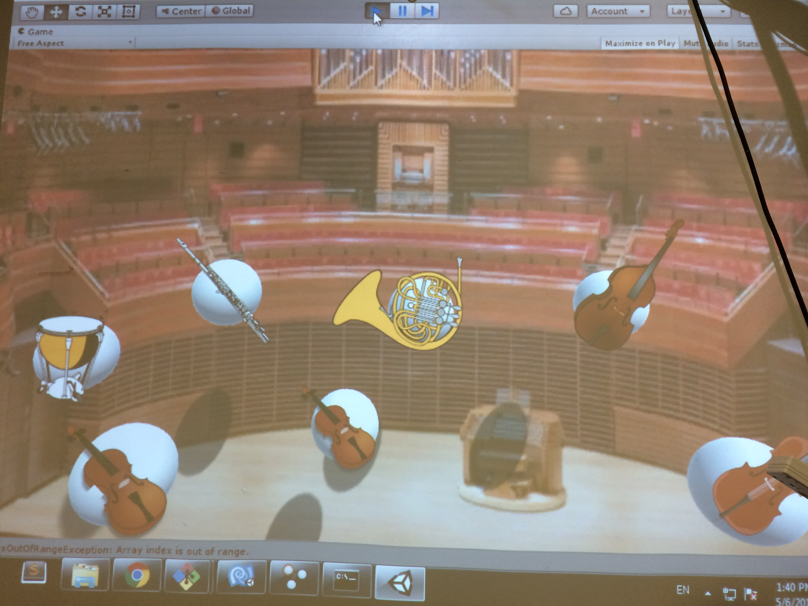
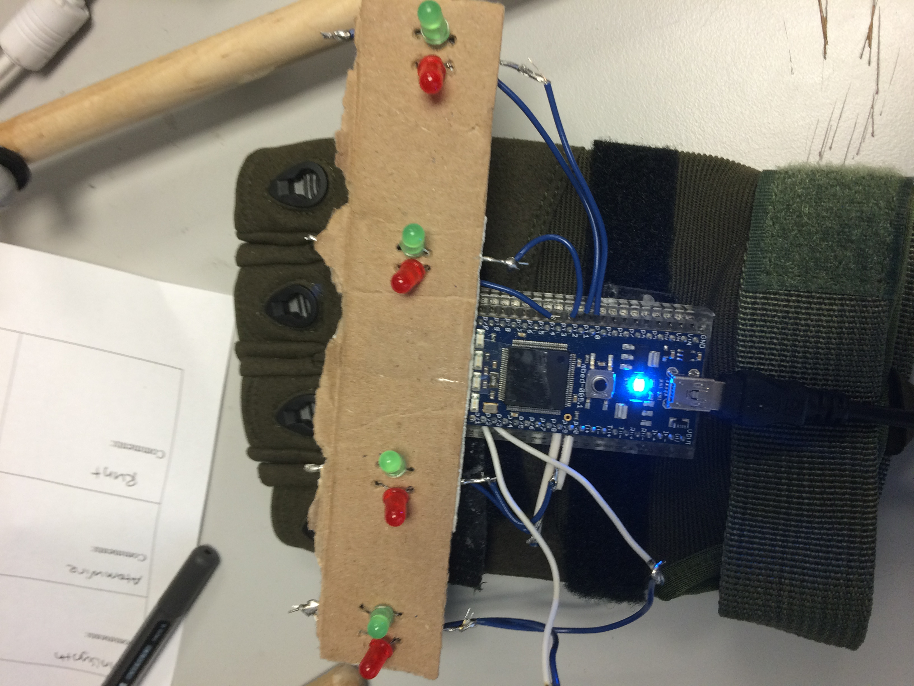

Week 5 - The End
================
In the last week we polished up the interface and added a haptic glove to allow "conductor hero" the game. 

Some fine tuning and changes were made to gesture recognition to make it more intuitive and easy to control individual instruments since in our baseline 1 we had some difficulties actually changing volume on the instruments. 

Part of the issue is the system needs to be recalibrated - we were having issues with tracking, but as soon as we recalibrated, most of our problems magically disappeared. 

<iframe width="420" height="315" src="https://www.youtube.com/embed/P7RbgcOuV_w" frameborder="0" allowfullscreen></iframe>

Also here is a link to our final report
<a  href = "{{ "assets/VIRTuosoFinalReport.pdf" | prepend: site.baseurl}}">Final Report</a>

Fifi