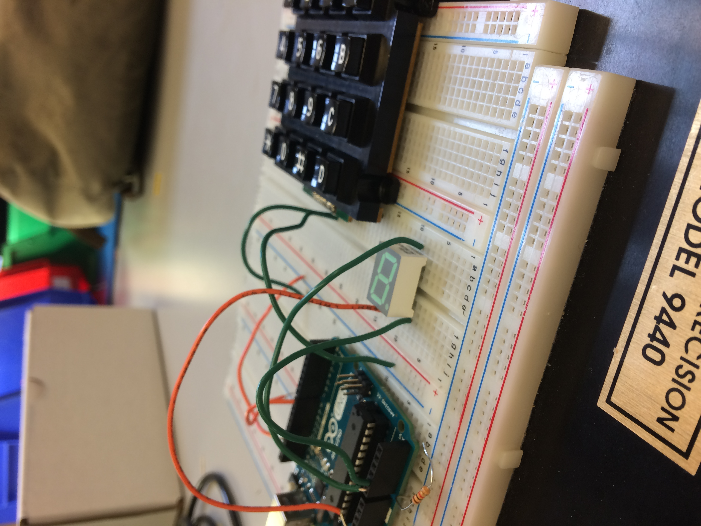

Lab 2 - Morse Code Decoder
==========================

Polling vs interrupt-driven 
The main difference is in the busy loop. When polling, you have continuously look for a change 
in the register you are polling for. This takes up precious resources on the microcontroller
since it's continuously looking for this. Also, it could lead to some small delays depending on how your polling works. 
For example, you have a large loop that's going and you poll at the end: you might start your subroutine 
that responds to the change a few clock cycles later since you are polling at the end of the loop.
When using an interrupt driven handler, you avoid the busy loop, and are less prone 
to this potential delay. 

For this task, interrupt driven makes a lot of sense. First, you definitely need the 
timer interrupt because you except all of these events to be over one overflow long. 
You could achieve the same thing with polling, but as discussed above, busy loops
are usually not a good thing. The edge capture interrupt is also better than polling. 


Our Finished Circuit
--------------------



    #include <avr/io.h> //Defines pins, ports, etc.
    #include <util/delay.h>
    #include <stdio.h>
    #include "uart.h"
    #include <avr/interrupt.h>
    #include <stdint.h>
    #include <util/delay.h>
    // declare globals
    unsigned int diff, edge1, edge2;
    unsigned long overflows;
    unsigned long pulse_width;
    int decode_key = 0x00;
    int count = 0;

The decoding code is rather boring but here it is in all its glory. 
It breaks them down into now many presses are required for the letter.

    // decode characters consisting of a single button press
    char decode_key_size_1(int key){
        // size 1 are T and E
        if(key & 0x01 == 1){
            return 'E';
        }else{
            return 'T';
        }
    }


    // decode characters consisting of two button presses
    char decode_key_size_2(int key){

        // size 1 are M,N,A and I
        if(key == 3){
            return 'I';
        }else if (key == 1){
            return 'A';
        }else if (key == 2){
            return 'N';
        }else {
            return 'M';
        }
    }

    // decode characters consisting of three button presses
    char decode_key_size_3(int key){

        // size 3 are O,W,K,U,G,R,D,S
        if(key == 0){
            return 'O';
        }else if (key == 1){
            return 'W';
        }else if (key == 2){
            return 'K';
        }else if (key == 3){
            return 'U';
        }else if (key == 4){
            return 'G';
        }else if (key == 5){
            return 'R';
        }else if (key == 6){
            return 'D';
        }else{
            return 'S';
        }
    }

    // decode characters conssting of four button presses
    char decode_key_size_4(int key){

        // size 3 are 1,J,Y,_,Q,?,X,V,.,P,C,F,Z,L,B,H
        if(key == 0){
            return '-';
        }else if (key == 1){
            return 'J';
        }else if (key == 2){
            return 'Y';
        }else if (key == 3){
            return '_';
        }else if (key == 4){
            return 'Q';
        }else if (key == 5){
            return '?';
        }else if (key == 6){
            return 'X';
        }else if (key == 7){
            return 'V';
        }else if (key == 8){
            return '.';
        }else if (key == 9){
            return 'P';
        }else if (key == 10){
            return 'C';
        }else if (key == 11){
            return 'F';
        }else if (key == 12){
            return 'Z';
        }else if (key == 13){
            return 'L';
        }else if (key == 14){
            return 'B';
        }else{
            return 'H';
        }

    }

Here is where the interesting code actually starts

    // init timer with x64 prescaler, set count to zero
    void timer1_init()
    {
        TCCR1B |= 0x03; // use 64 prescalar
        TCNT1 = 0; //reset tcnt
    }


    // falling edge interrupt routine
    void static inline falling_edge_interrupt()
    {
        // reset overflow count
        overflows = 0;
        
        // set global edge1 timer
        edge1 = ICR1;

        // set trigger to rising edge
        TCCR1B |= 0x40;

        // clear flag
        TIFR1 |= 0x20;
    }


    void static inline rising_edge_interrupt()
    {
        
        // set global edge2 timer
        edge2 = ICR1;

        // set trigger to falling edge
        TCCR1B &= 0xBF;
        // Clear flag
        TIFR1 |= 0x20;

        // account for overflow edge case
        if (edge2 < edge1){
            overflows--;
        }

        // calcualte difference, pulse width
        diff = edge2 - edge1;

        // 30ms
        if(overflows == 0 && diff < 7500){}
        // 30ms -> 200ms
        else if (overflows == 0 && diff < 50000){
            
            // add value to decode key, inc count
            decode_key |= (1 << count);
            count++;
            
            // flash LED dot for 200ms
            PORTC &= 01;
            _delay_ms(200);
            PORTC |= 11;
        }
        else if (overflows < 2 || (overflows == 2 && diff < 20000) ){ 

            // add no value to decode key, inc count
            count++;

            // flash LED bar for 200ms
            PORTC &= 10;
            _delay_ms(200);
            PORTC |= 11;
        
        }
        // account for too long button presses
        else{}

        // reset overflow count

        overflows = 0;
    }


    // Timer interrupt
    ISR(TIMER1_CAPT_vect){


        // determine if edge is falling or rising
        // select interrupt routine accordingly
        if (!(TCCR1B & 0x40))
        {
            falling_edge_interrupt();
        }else
        {
            rising_edge_interrupt();
        }

    }

    // timer overflow interrupt
    ISR(TIMER1_OVF_vect){
        
        // increment overflow
        overflows++;


        // detect space, decode keystring
        if (overflows > 4){
            if(count > 0){
                char out;

                if(count == 1){
                    out = decode_key_size_1(decode_key);
                }else if (count == 2){
                    out = decode_key_size_2(decode_key);
                }else if (count == 3){
                    out = decode_key_size_3(decode_key);
                }else if (count == 4){
                    out = decode_key_size_4(decode_key);
                }

                // print decoded char, reset key

                printf("%c ",out);
                decode_key = 0x00;
                count = 0;
            }
        }

    }

    int main(void) {

        // start serial communication
        uart_init();

        DDRC |= (11 << 0); //Data Direction Register B: writing a 1 to the bit enables output
            
        // enable input interrupt capture
        TIMSK1 |= 0x21;
        
        // set portc = hi
        PORTC = 0xFF;

        // turn interrupts on 
        sei();

        // turns ICP1 to high 5v
        PORTB |= (1 << 0);

        // init timer
        timer1_init();
        
        overflows = 0;

        // set trigger to falling edge
        TCCR1B &= 0xBF;
        // Clear flag
        TIFR1 |= 0x20;


        while(1){}
        return (0); //this line is never actually reached
    }
```
